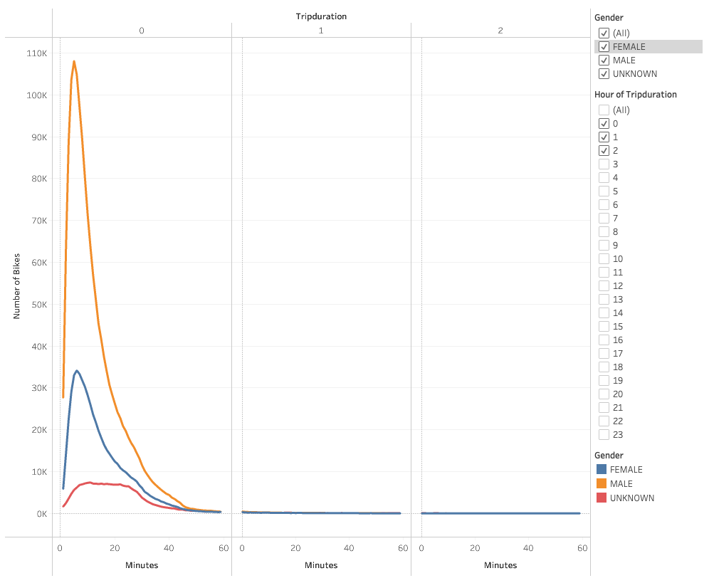

# bikesharing

## Overview

In this project, we analyzed bike sharing data from Citi Bike in New York with the goal of gaining insights for our own bikeshare company. We gained valuable insights into the mechanics of the bikesharing operation, and we used Tableau to convert these insights into compelling vizualizations. 

## Results

The interactive Tableau vizualizations can be accessed through the following link: 
[link to bikesharing dashboard](https://public.tableau.com/profile/ryan.cook1987#!/vizhome/Citi_Bike_Challenge_16178270170390/Story1?publish=yes)

The following images are screenshots of the interactive data visualizations we created. 

### Checkout Times for Users

This graph shows frequency of different trip durations. As you can see, the vast majority of trips durations were under 1 hour.

### Checkout Times by Gender

This graph shows trip duration by gender. Males typically have longer trip durations. 

### Trips be Weekday for Each Hour

This heatmap represents the number of trips for each day of the week and each hour of the day. Morning and afternoon commuting hours are popular trip times.

### Trips by Gender (Weekday per Hour)

This vizualization is similar to the prior heatmap, but breaks down the categories futher into genders. 

### User Trips by Gender Weekday

Here we see the frequency of trips by day of the week for each gender. We also compare the frequency of trips of customers versus subscribers.

### Top Starting Locations

This map shows the most popular starting locations, with the larger and darker dots representing the most popular starting locations in New York.

### Top Ending Locations

Similarly, this map represents the most popular ending locations, with the larger and darker dots representing the most popular ending trip locations.
